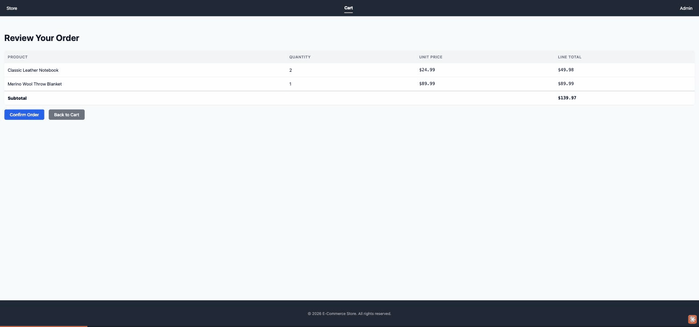
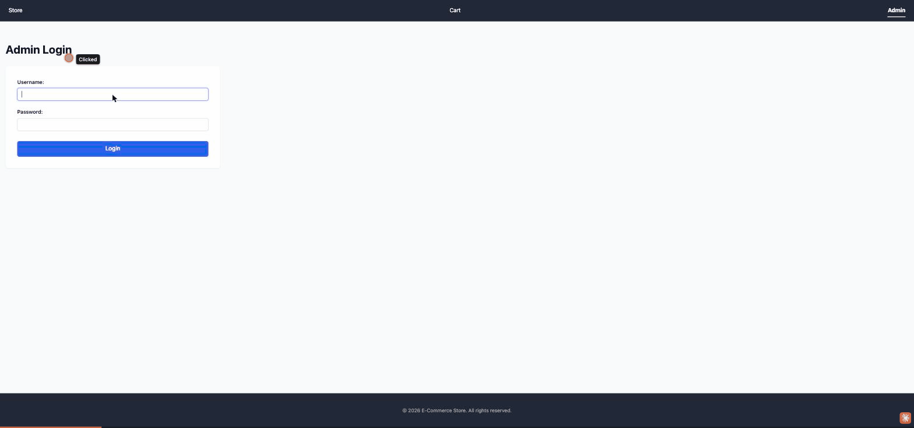

<div align="center">

# AItelier

**The trusted, auditable layer for AI agents — run _any_ multi-agent workflow deterministically, with a complete audit trace and human checkpoints.**


[-F59E0B)](https://github.com/linxuhao/SkillFlow)


*The flagship pipeline: research → architect → plan → implement → verify — with reject-with-feedback checkpoints and a goal-loop that sends work back to planning on its own.*

</div>

AItelier makes multi-agent AI pipelines **deterministic and fully auditable** — define a pipeline, run it, and inspect *why* it did everything it did. Today that's an open engine ([SkillFlow](https://github.com/linxuhao/SkillFlow), MIT, on PyPI as `skillflow-py`) plus a flagship software-delivery pipeline; the broader no-code **workflow platform** is on the [roadmap](#roadmap).

## Why AItelier

Most "AI agent" tooling is built for demos, not trust. The tools that build software or automate a workflow for you are non-deterministic black boxes: you can't reproduce a run, audit *why* the agent did what it did, or insert a human approval where it matters. That's exactly the wall that stops agents from being deployed in anything serious — regulated industries, enterprise, anywhere "it usually works" isn't good enough.

AItelier is built on the opposite premise — that an autonomous pipeline should be **trustworthy by construction**:

- **Deterministic** — pipelines are graphs (DAGs) traversed by the engine, not control flow improvised by an LLM. Same config, same path. Loops, gates, retries, and recovery are the engine's job, not the model's.
- **Minimal LLM surface (least privilege)** — each agent sees only the context it declares, and the [SkillFlow](https://github.com/linxuhao/SkillFlow) engine generates a constrained **write tool per declared output** (and gates reads to declared context) — so an agent *cannot* read or write a file outside its contract. Concretely in the software pipeline: the Researcher can only search the web; the Architect, planners, reviewers, and final verifier are read-only; *only* the Implementer can write code. The model makes the judgment calls; the framework and its generated tools do everything deterministic — *brain to brain, tools to tools*. It's also why cheap models suffice: small, focused, role-scoped context.
- **Fully traceable** — every run keeps an append-only audit trace that is *never deleted*: each step, prompt, model response, and tool call. "Why did this run do that?" is one query, not forensic archaeology.
- **Human-in-the-loop** — approval/reject checkpoints are first-class between stages; review and send work back with feedback at any point.
- **Adversarial quality** — every step is produced by a Green (Maker) agent and reviewed by a Red (Checker) agent before it advances.
- **Config-agnostic** — a pipeline can be *anything*. Nothing about the engine is hardcoded to one workflow; SkillFlow can even generate a new pipeline from a plain-language description.

## What you can build

> **The vision** (see [Project status](#project-status) for exactly what's built today vs. what's planned).

AItelier is meant to be used two ways:

1. **Run the flagship software pipeline (DPE)** — ✅ *works today.* Describe a project; it researches, architects, plans, implements, and verifies it end-to-end, with human checkpoints and a complete trace. (That's the demos below.)
2. **Build your own auditable workflow** — *partly today, mostly roadmap.* Pipelines aren't limited to software. Today you define a workflow as a [SkillFlow](https://github.com/linxuhao/SkillFlow) pipeline (YAML) and run it through AItelier; a no-code visual builder and managed workspaces are on the [roadmap](#roadmap).

**Why software-delivery is the wedge _and_ the keystone.** We lead with autonomous software-building because it's the hardest possible proof the engine works — and because **an AI workflow *is* software** (a pipeline is a graph plus tools plus templates). The same deterministic factory that builds software is what will let you *trust a workflow you build on AItelier* — building a new auditable workflow is itself a software-engineering task. A trusted software pipeline builds trusted workflows.

**Open-core.** [SkillFlow](https://github.com/linxuhao/SkillFlow) (MIT) is the engine and is embeddable in *any* agent system; the AItelier CLI is source-available (free to use, see [License](#license)); a managed multi-tenant platform is on the [roadmap](#roadmap).

## Project status

Honest, current state — so nothing here reads as more finished than it is.

**Legend:** ✅ Available today (built & tested)  ·  🚧 Roadmap (designed, not built)  ·  🔭 Long-term vision

| Capability | Status |
| --- | --- |
| Flagship **DPE software pipeline** — research → architect → plan → implement → verify | ✅ Available today |
| Green/Red adversarial review · human approve/reject-with-feedback checkpoints · autonomous goal-loop | ✅ Available today |
| Append-only trace + trace API · Git event-sourcing · Rich CLI/TUI | ✅ Available today |
| Runs on the [SkillFlow](https://github.com/linxuhao/SkillFlow) engine (deterministic DAG execution, tools, checkpoints, durable trace) | ✅ Available today |
| Final verifier **runs** the generated app (runtime smoke-test) | 🚧 Roadmap — *today it reviews code statically and can miss runtime bugs* |
| No-code visual workflow builder · managed multi-tenant SaaS · collaboration & compliance tooling | 🚧 Roadmap |
| Horizontal expansion beyond software delivery, on the same engine | 🔭 Vision |

**Where the company is:** the engine and the flagship pipeline are built and tested; there are **no users, revenue, or managed platform yet.** This is a working foundation, not a finished product.

## Install

**Requires Python 3.12+** (check with `python3 --version`; on macOS the system `python3` is often older — use a 3.12 venv).

```bash
python3.12 -m venv .venv && source .venv/bin/activate
# Install AItelier (the skillflow-py framework is pulled from PyPI automatically)
pip install -e .
```

## Quick Start

First, set up your API key. The default pipeline runs on **DeepSeek** (`deepseek-v4-flash` / `deepseek-v4-pro`), so all you need is a `DEEPSEEK_API_KEY`:

```bash
# Copy the template and fill in your real key
cp .env.example .env
# edit .env to add DEEPSEEK_API_KEY, then load it
source .env
```

To use a different provider, point the agent configs at it (see [Configuration](#configuration)).

```bash
aitelier                          # Interactive CLI dashboard
aitelier "build me a todo app"    # One-shot pipeline
aitelier server                   # Backend server
```

## Demos

The flagship DPE pipeline planning, building, and reviewing a real e-commerce app — a customer storefront **and** an admin panel — end to end: **66 pipeline steps, 0 failures, entirely on cheap non-frontier models** (DeepSeek — no GPT/Claude/Gemini in the loop). The hero GIF at the top and the trace below are from this run. *Separately*, when a bug report was later fed back in, AItelier diagnosed and fixed its own code (see below).

**The generated app — customer storefront & admin panel** (from a single goal, pure Python standard library)

**📂 Browse the full generated source: [linxuhao/aitelier-e-commerce-store-demo](https://github.com/linxuhao/aitelier-e-commerce-store-demo)** — every file was produced by the pipeline (the commit history *is* the build log); only its README is hand-written.

| Customer storefront | Admin panel |
| --- | --- |
|  |  |

> Browse → cart → checkout → order confirmed, and admin login → dashboard → add / edit / delete.

**Every decision is auditable — the trace API**


> 1000+ durable records per run — every prompt, model response, tool call, and Green/Red review verdict — queryable by step or category.

**What this run demonstrates**
- The **goal-loop fired autonomously** (final verifier → back to planning → converged on the next pass) — not scripted.
- Re-pointed at the existing codebase with a bug report, AItelier **diagnosed the root cause and authored the fix itself**.
- The intelligence is in the **orchestration**, not the model bill — the whole pipeline runs on DeepSeek `v4-flash` / `v4-pro`.

> Honest caveat: the cart bug above slipped past the pipeline's verifier because it reviews code *statically* and doesn't yet run the app — see [Project status](#project-status) and [Roadmap](#roadmap). Finding it required running the app by hand; AItelier then fixed it.

## See it in action

A typical run with the flagship DPE pipeline:

1. **Describe what you want.** Tell the meta agent your goal. It asks a few scoping questions, drafts a project brief, and — once you approve — starts the pipeline.
2. **Watch it work, with checkpoints.** Research → Architect → PM → per-task Plan/Implement/Verify → Final Verification. It **pauses at review checkpoints** so you can **approve** or **reject with feedback** (e.g. *"the design is missing input validation"*) and watch the agent revise.
3. **Inspect the trace.** Every prompt, response, and tool call is in an append-only audit log — answer "why did it do that?" for any step, after the fact.
4. **Run the result.** The generated project (code + tests + README) lands in your workspace, ready to run.

## Configuration

To change which models or agents the pipeline uses, edit the config files directly:

- **`llm_providers.json`** — LLM providers (base URLs, API-key env var names)
- **`agent_configs/`** — per-role model, template, tools, and thinking settings
- **`templates/`** — the LLM prompt templates each step uses

## How it works

AItelier defines its workflow as a **SkillFlow graph** of stateless agent steps. The SkillFlow engine owns traversal, tool execution, checkpoints, and the durable trace; AItelier supplies the agents, templates, tools, and UI.

Agents never hold state in memory. Each step receives its context from the outputs of prior steps, writes its results into a per-step staging directory that the engine validates and then promotes, and every promoted change is committed to **Git (event sourcing)** — so any run can be replayed or inspected after the fact. A scheduler drives the loop one step at a time: `advance → claim → execute → confirm`. The default DPE pipeline applies this to software delivery, but because a pipeline is just config, the same engine runs any auditable multi-agent workflow.

## Architecture

AItelier is a **host application** on top of the SkillFlow framework:

- **Configs** (`configs/`, `agent_configs/`) — pipeline graph and LLM agent definitions
- **Templates** (`templates/`) — per-step LLM system prompts
- **Tools** (`aitelier/tools/`) — AItelier custom tools + SkillFlow native tools
- **Core** (`core/`) — agents, scheduler, AI router, DB, workspace
- **API** (`api/`, `web_api/`) — the CLI backend, plus an early multi-tenant Web backend
- **CLI** (`cli/`) — Rich TUI dashboard

```
Meta Conversation (gather requirements)
  → DPE Pipeline:
    Research → Architect → PM → [per task: Plan → Implement → Verify]
    → Final Verification
```

## Roadmap

Building on the foundation that works today ([Project status](#project-status) above), in priority order.

**🚧 Next (designed, not yet built)**
- **Runtime-verifying delivery** — the final verifier reasons about code *statically* today; next it boots the generated app and smoke-tests it, so the goal-loop triggers on real runtime failures, not just static review.
- **The managed platform** — multi-tenant workspaces, a no-code visual workflow builder, shareable/managed runs, and the audit & compliance tooling teams need to deploy agents in production.

**🔭 Longer-term (the bet, not a commitment)**
- **The open format as a standard** — if SkillFlow's YAML becomes a common way to *define* agentic workflows, every config in the ecosystem runs natively here.
- **Audit-first & EU-resident** — position the immutable, never-deleted trace as the compliance-grade record that environments like the EU AI Act's traceability requirements demand.

## Tests

```bash
pytest tests/unit/ -v          # ~300 unit tests
pytest tests/integration/ -v   # ~160 integration tests
pytest tests/ -v               # full suite (~490 tests)
```

## License

AItelier is **source-available** under the [Functional Source License (FSL-1.1-MIT)](LICENSE).

You may **use, modify, and self-host AItelier freely** — for internal use, education, research, and professional services. The only restriction is a **Competing Use**: you may not offer AItelier (or a substantially similar substitute) to others as a commercial product or service. Two years after each release, that version automatically converts to the **MIT license**.

The underlying pipeline engine, [SkillFlow](https://github.com/linxuhao/SkillFlow), is fully open source under the MIT license.
