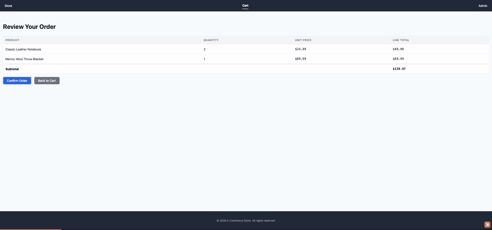
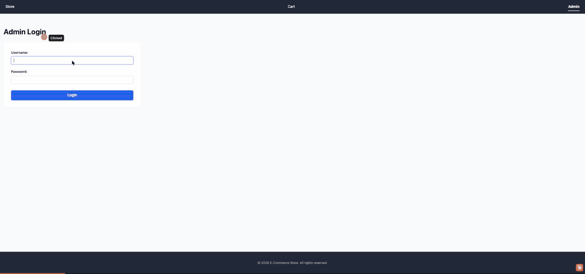

<div align="center">

# AItelier

**Structured-but-dynamic subagent workflows for AI agents — your agent delegates work to deterministic, fully-audited pipelines it can generate, run, and edit over MCP.**


[-F59E0B)](https://github.com/linxuhao/SkillFlow)

</div>

AItelier makes multi-agent AI pipelines **deterministic and fully auditable** — define a pipeline (or have your agent generate one), run it, and inspect *why* it did everything it did. The whole surface is exposed over **MCP**, so any MCP-speaking agent can use AItelier as its workflow engine: delegate bulk work to cheap, deterministic pipelines and only decide at checkpoints (see [Use AItelier from another agent](#use-aitelier-from-another-agent-mcp)). Under it all is an open engine ([SkillFlow](https://github.com/linxuhao/SkillFlow), MIT, on PyPI as `skillflow-py`) plus a flagship software-delivery pipeline; the broader no-code **workflow platform** is on the [roadmap](#roadmap).

## Why AItelier

Most "AI agent" tooling is built for demos, not trust. The tools that build software or automate a workflow for you are non-deterministic black boxes: you can't reproduce a run, audit *why* the agent did what it did, or insert a human approval where it matters. That's exactly the wall that stops agents from being deployed in anything serious — regulated industries, enterprise, anywhere "it usually works" isn't good enough.

AItelier is built on the opposite premise — that an autonomous pipeline should be **trustworthy by construction**:

- **Deterministic** — pipelines are graphs (DAGs) traversed by the engine, not control flow improvised by an LLM. Same config, same path. Loops, gates, retries, and recovery are the engine's job, not the model's.
- **Minimal LLM surface (least privilege)** — each agent sees only the context it declares, and the [SkillFlow](https://github.com/linxuhao/SkillFlow) engine generates a constrained **write tool per declared output** (and gates reads to declared context) — so an agent *cannot* read or write a file outside its contract. Concretely in the software pipeline: the Researcher can only search the web; every other role can write only its own declared output (a design doc, a plan, a review verdict, or the project README) — and *only* the Implementer's outputs are code. The model makes the judgment calls; the framework and its generated tools do everything deterministic — *brain to brain, tools to tools*. It's also why cheap models suffice: small, focused, role-scoped context.
- **Fully traceable** — every run keeps an append-only audit trace that is *never deleted*: each step, prompt, model response, and tool call. "Why did this run do that?" is one query, not forensic archaeology.
- **Human-in-the-loop** — approval/reject checkpoints are first-class between stages; review and send work back with feedback at any point.
- **Adversarial quality** — every step is produced by a Green (Maker) agent and reviewed by a Red (Checker) agent before it advances.
- **Config-agnostic** — a pipeline can be *anything*. Nothing about the engine is hardcoded to one workflow; SkillFlow can even generate a new pipeline from a plain-language description.

**Where this sits.** Classic workflow engines are structured but *static* — a human authors the graph, and changing it is a deploy. Autonomous agent swarms are dynamic but *unstructured* — improvised control flow that can't be reproduced or audited. AItelier is deliberately the missing quadrant: **structured but dynamic**. *During* a run the graph is fixed and engine-traversed — gates, retries, and the trace are mechanical. *Between* runs, an agent can generate a new pipeline from a description, drive it, read the trace of what broke, and edit it — all over MCP. Your agent stays the brain; AItelier is the factory floor it can re-tool.

## What you can build

> **The vision** (see [Project status](#project-status) for exactly what's built today vs. what's planned).

AItelier is meant to be used three ways — the first is the center of gravity:

1. **Give your agent a workflow engine (MCP)** — ✅ *works today.* Point any MCP-speaking agent at the `/mcp` endpoint and it gets the whole surface as native tools: the full **generate → run → observe → fix** loop, checkpoint answering, the trace, model routing, and pipeline export/import. Your agent delegates the bulk work to deterministic pipelines on cheap models and only decides at the checkpoints (see [Use AItelier from another agent](#use-aitelier-from-another-agent-mcp)).
2. **Build your own auditable workflow — just describe it** — ✅ *works today.* Pipelines aren't limited to software. **Describe a workflow in chat** (or over MCP) and AItelier's grounded generator turns it into a real SkillFlow pipeline — provisioning any missing tools, wiring and gating the graph, and registering it to run by name (see [Generate a workflow from a description](#generate-a-workflow-from-a-description)). You can still hand-author YAML directly; a no-code *visual* builder and managed workspaces are on the [roadmap](#roadmap).
3. **Run the flagship software pipeline (DPE) standalone** — ✅ *works today.* Describe a project; it researches, architects, plans, implements, and verifies it end-to-end, with human checkpoints and a complete trace. (That's [See it in action](#see-it-in-action) below — and the proof that the engine holds up under the hardest workload.)

**Why software-delivery is the wedge _and_ the keystone.** We lead with autonomous software-building because it's the hardest possible proof the engine works — and because **an AI workflow *is* software** (a pipeline is a graph plus tools plus templates). The same deterministic factory that builds software is what will let you *trust a workflow you build on AItelier* — building a new auditable workflow is itself a software-engineering task. A trusted software pipeline builds trusted workflows.

**Open source.** [SkillFlow](https://github.com/linxuhao/SkillFlow) is the engine and is embeddable in *any* agent system; AItelier is the host application around it. Both are MIT (see [License](#license)); a managed multi-tenant platform is on the [roadmap](#roadmap).

## Project status

Honest, current state — so nothing here reads as more finished than it is.

**Legend:** ✅ Available today (built & tested)  ·  🚧 Roadmap (designed, not built)  ·  🔭 Long-term vision

| Capability | Status |
| --- | --- |
| Flagship **DPE software pipeline** — research → architect → plan → implement → verify | ✅ Available today |
| **MCP endpoint + DeepSeek Harness plugin** — drive AItelier from any MCP-speaking agent: list / edit / run / export / import pipelines as native tools | ✅ Available today |
| Green/Red adversarial review · human approve/reject-with-feedback checkpoints · autonomous goal-loop | ✅ Available today |
| Append-only trace + trace API · Git event-sourcing · Rich CLI/TUI | ✅ Available today |
| Runs on the [SkillFlow](https://github.com/linxuhao/SkillFlow) engine (deterministic DAG execution, tools, checkpoints, durable trace) | ✅ Available today |
| **Generate a pipeline from a plain-language description** — grounded generator provisions missing tools, wires + gates the graph, registers it to run by name | ✅ Available today |
| Final verifier **runs** the generated app (runtime smoke-test) | 🚧 Roadmap — *today it reviews code statically and can miss runtime bugs* |
| No-code visual workflow builder · managed multi-tenant SaaS · collaboration & compliance tooling | 🚧 Roadmap |
| Horizontal expansion beyond software delivery, on the same engine | 🔭 Vision |

**Where the company is:** the engine and the flagship pipeline are built and tested; there are **no users, revenue, or managed platform yet.** This is a working foundation, not a finished product.

## See it in action

**Browse a live deployment right now: [aitelier.linxuhao.app](https://aitelier.linxuhao.app)** (public read access). Open any run and watch the pipeline graph with the **current step highlighted and its trace streaming live beside it** — for example, [a real game-feature run](https://aitelier.linxuhao.app/#/projects/jinyong-hud). Reads are open to anyone; writes require the Cloudflare Access allowlist ([how that split works](#run-with-docker--cloudflare)).

A typical run with the flagship DPE pipeline:

1. **Describe what you want.** Tell the butler your goal. It picks one of two paths automatically:
   - **Path A — Pipeline Offload** (fast): for small bug fixes or features (~5 files) on existing projects, offloads directly to a subagent/fix_tests/investigate pipeline — no requirements conversation needed.
   - **Path B — DPE** (safe default): for new projects and non-trivial changes, asks scoping questions, drafts a project brief, and — once you approve — starts the full research → architect → plan → build pipeline.
2. **Watch it work, with checkpoints.** Research → Architect → PM → per-task Plan/Implement/Review → Final Verification. It **pauses at review checkpoints** so you can **approve** or **reject with feedback** (e.g. *"the design is missing input validation"*) and watch the agent revise.
3. **Inspect the trace.** Every prompt, response, and tool call is in an append-only audit log — answer "why did it do that?" for any step, after the fact.
4. **Run the result.** The generated project (code + tests + README) lands in your workspace, ready to run.

### Recorded demo: the e-commerce run

The flagship DPE pipeline planning, building, and reviewing a real e-commerce app — a customer storefront **and** an admin panel — end to end: **66 pipeline steps, 0 failures, entirely on cheap non-frontier models** (DeepSeek — no GPT/Claude/Gemini in the loop). *Separately*, when a bug report was later fed back in, AItelier diagnosed and fixed its own code (see below).

**The generated app — customer storefront & admin panel** (from a single goal, pure Python standard library)

**📂 Browse the full generated source: [linxuhao/aitelier-e-commerce-store-demo](https://github.com/linxuhao/aitelier-e-commerce-store-demo)** — every file was produced by the pipeline (the commit history *is* the build log); only its README is hand-written.

| Customer storefront | Admin panel |
| --- | --- |
|  |  |

> Browse → cart → checkout → order confirmed, and admin login → dashboard → add / edit / delete.

**Every decision is auditable — the trace API**


> 1000+ durable records per run — every prompt, model response, tool call, and Green/Red review verdict — queryable by step or category.

**What this run demonstrates**
- The **goal-loop fired autonomously** (final verifier → back to planning → converged on the next pass) — not scripted.
- Re-pointed at the existing codebase with a bug report, AItelier **diagnosed the root cause and authored the fix itself**.
- The intelligence is in the **orchestration**, not the model bill — the whole pipeline runs on DeepSeek `v4-flash` / `v4-pro`.

> Honest caveat: the cart bug above slipped past the pipeline's verifier because it reviews code *statically* and doesn't yet run the app — see [Project status](#project-status) and [Roadmap](#roadmap). Finding it required running the app by hand; AItelier then fixed it.

## Install

**Requires Python 3.12+** (check with `python3 --version`; on macOS the system `python3` is often older — use a 3.12 venv).

```bash
python3.12 -m venv .venv && source .venv/bin/activate
# Install AItelier (the skillflow-py framework is pulled from PyPI automatically)
pip install -e .
```

## Quick Start

```bash
cp llm_providers.example.json llm_providers.json   # providers: URL + key NAME
cp model_routes.example.json  model_routes.json    # models: which endpoints serve each
cp .env.example .env                               # endpoints and options; NOT the keys

# Which key files do YOUR tables need? The key name is the provider table's, not this page's
# (imports core.*, so run it inside the venv the Install step created):
python -c "from core.external_deps import required_llm_keys, failover_llm_keys; \
           print('required:', required_llm_keys()); print('failover:', failover_llm_keys())"

mkdir -p ~/.aitelier-secrets && chmod 700 ~/.aitelier-secrets
printf '%s' "<your-key>" > ~/.aitelier-secrets/<KEY_NAME> && chmod 600 ~/.aitelier-secrets/<KEY_NAME>
```

Three things worth knowing before you customize — the full routing story (provider/endpoint/model levels, the failover policy, what each model must be) is in **[docs/models-and-providers.md](docs/models-and-providers.md)**:

- The **model names are the contract**: `agent_configs/*.yaml` reference `flash` / `pro` / `glm` / `smart` / `vision`; what sits behind each is yours to choose. Skip the `cp` entirely and the examples serve as fallback, so a fresh clone still runs.
- Keys are **secret FILES, not environment variables** — so the test/build subprocesses a pipeline runs cannot inherit them. Which files exist is *derived from your provider tables* (that's the probe above); with the shipped examples it prints `ARK_API_KEY` required, DeepSeek and Qwen as failover.
- A missing key fails **loudly**, naming the provider, the key, the file to create, and the model that sent it there.

> **The backend runs in Docker** — a host process would make the pipeline's git commits carry your own `~/.gitconfig` identity, so the CLI never silently falls back to one. `aitelier` starts the container for you (and creates the secret files it mounts). The one escape hatch is explicit: `aitelier server --no-docker` runs uvicorn in-process, for debugging outside a container or a deployment that supplies its own git identity.

```bash
aitelier                          # Interactive CLI dashboard
aitelier "build me a todo app"    # One-shot pipeline
aitelier server                   # Backend container (start/reuse)
```

### Run with Docker (+ Cloudflare)

The backend and web UI also ship as a container. The CLI starts it automatically if Docker is running (and reuses it if already up), or you can manage it directly:

```bash
docker compose up -d              # multi-stage build (Node.js → Svelte bundle + Python runtime); serves API + web UI on :4444
docker compose logs -f
```

Compose mounts its API keys as **secret files**, and Docker refuses to start a
service whose secret source is missing. The CLI creates them for you; if you run
`docker compose` by hand, create them first (empty means "I don't use this").
Also create the state dir **as your user** — if it does not exist, the Docker
daemon creates the bind source as `root:root` and the container (which runs as
your uid) crash-loops on `sqlite3.OperationalError: unable to open database
file` without ever mentioning permissions:

```bash
mkdir -p ~/.AItelier
mkdir -p ~/.aitelier-secrets && chmod 700 ~/.aitelier-secrets
cd ~/.aitelier-secrets && touch ARK_API_KEY DEEPSEEK_API_KEY QWEN_API_KEY GITHUB_TOKEN LOCAL_QWEN_API_KEY && chmod 600 *
printf '%s' "<your-key>" > ~/.aitelier-secrets/<KEY_NAME>   # the probe in Quick Start names it
```

`docker compose up -d` also starts **aitelier-godot** — the compile/playtest
sidecar for the game pipeline. Harmless if unused; `docker compose up -d aitelier`
starts just the main service.

The names above mirror the shipped example provider tables — the authoritative
list is the `secrets:` block at the bottom of `docker-compose.yml`, and it is
not fixed: swap the provider tables and your key names change with them. The
secrets dir is deliberately **not** bind-mounted (so keys never appear in any workspace-visible path), which means a provider you add with a **new** key name also needs its own `secrets:` entry in the compose file.

Publishing through an existing **cloudflared** connector is one line. The network
lives in `docker-compose.yml` itself and is selected BY NAME, with no
`external:` and no `-f` overlay — there used to be one, and forgetting it on a
rebuild took the public path down while every container stayed healthy.

```bash
echo 'AITELIER_EDGE_NETWORK=cloudflare_edge' >> .env   # docker network ls → your connector's
```

Confirm the name against `docker network ls` and against the network your
connector is actually on. A name that matches nothing is **created**, not
refused: the container comes up healthy, `127.0.0.1:4444` answers 200, and the
tunnel is dark with nothing logging an error. Leave the variable unset and
AItelier stays on loopback.

Other than that, a clean checkout starts with no pre-existing Docker resources.
Every capability that needs something outside this repo — the LLM key, web
search, media generation, the Godot gates — is optional, refuses with a message
naming the config it wants, and is listed in
**[docs/external-dependencies.md](docs/external-dependencies.md)**. For the whole path from an empty machine to a finished pipeline — every step, what can go wrong at it, and what covers it — see **[docs/install-route.md](docs/install-route.md)**.

**If a run looks stuck**, read the scheduler tick log rather than the container
log. The scheduler advances one project per tick, so a project that cannot
advance blocks the others — and the tick log is where it says why:

```bash
grep 'outcome=claim_failed' ~/.AItelier/logs/scheduler_ticks.log
# project=my-project outcome=claim_failed run=2f6c30c4
#   error=Required context source resolved to no content: finalize.
```

It rotates (5MB × 3) and lives on the mounted volume, so it survives container
recreation. One line per tick; outcomes are `idle`, `locked`, `run_start_failed`,
`active_claim`, `terminal`, `claim_failed`, `no_claim`, `executed`.

State lives in host `~/.AItelier` (bind-mounted). The port is published on loopback only; expose it publicly via a **Cloudflare tunnel**. With Cloudflare Access in front, **reads are open to any logged-in user and writes are restricted to an allowlist** — set `AITELIER_CF_TEAM_DOMAIN`, `AITELIER_CF_AUD`, and `AITELIER_WRITERS` in `.env` (all documented in `.env.example`). The CLI authenticates to its own container with `AITELIER_ADMIN_TOKEN`.

## Use AItelier from another agent (MCP)

**This is the primary way to use AItelier.** The backend exposes its whole pipeline surface as an **MCP endpoint** (`/mcp`, streamable HTTP) — so any MCP-speaking agent can use AItelier as a *structured-but-dynamic subagent*: instead of improvising a long multi-step job in its own context (unreproducible, unauditable, at frontier-model prices), the agent delegates it to a deterministic pipeline and gets back a durable trace it can query. The surface is **39 tools** covering the four artefact kinds (pipeline graph, agent roles, prompt templates, custom tools) with list / get / edit on each, plus:

- **`run_pipeline` + `wait_for_run` + `answer_checkpoint`** — start a run (returns immediately; runs are long and may pause for approval) and block until it settles at a checkpoint, completion, *or failure* — push-based, no polling. Checkpoints stay first-class in this frame: the **calling agent** can approve or reject-with-feedback itself, or escalate the decision to its human.
- **the full generate → drive → observe → fix loop** — `generate_pipeline` writes a new pipeline ([how generation works](#generate-a-workflow-from-a-description)), `run_pipeline` + `wait_for_run` + `answer_checkpoint` drive it, `get_run_summary` and the `trace_*` tools say what broke, and the `edit_*` tools fix it. AItelier's scheduler runs the pipeline; the external agent only decides at checkpoints and between runs.
- **the model routing tables** — `get_available_models` says which models this deployment serves and whether each endpoint behind them can actually answer; `add_provider` / `map_model` / `unmap_model` / `delete_*` edit them. Which vendors you use is deployment config, so this is how an agent configures a machine it did not set up.
- **`export_pipeline` / `import_pipeline`** — carry a generated pipeline between machines as **one self-contained JSON bundle**: its graph, its roles *with* their prompts, and any custom tool it needs. Import validates everything before writing, renames safely, and refuses to silently overwrite a same-named tool that differs.

Authorization is **per tool**, not per route: read tools are open, write tools require the same authorization as the web UI (Cloudflare Access allowlist, or `AITELIER_ADMIN_TOKEN` off-tunnel). Without credentials you get a legitimate read-only installation — write tools answer `denied: …` and change nothing.

For **[DeepSeek Harness](https://github.com/deepseek-ai/deepseek-harness)** (`dsh`) there's a ready plugin bundle in [`integrations/dsh/`](integrations/dsh/) — one command installs it into a profile and registers the tools as `mcp__aitelier__*`:

```bash
dsh plugin --profile headless add <path-to>/AItelier/integrations/dsh
echo 'AITELIER_MCP_URL=http://127.0.0.1:4444/mcp' >> ~/.dsh/.env   # where your AItelier runs
```

Any other MCP host configures the same endpoint URL directly (streamable HTTP transport). It needs a running backend — [Install](#install) above, or `docker compose up -d`.

## Generate a workflow from a description

**Don't want to hand-write a pipeline? Describe it.** ✅ *Works today.* In the butler's **coding mode** — or from any external agent [over MCP](#use-aitelier-from-another-agent-mcp) — the `generate_pipeline` tool turns a plain-language workflow into a real, runnable [SkillFlow](https://github.com/linxuhao/SkillFlow) pipeline — grounded in the live tool registry, self-provisioning any tools it needs, and gated before it ships. No YAML by hand, no server restart.

1. **Describe it.** *"Make a pipeline that researches a topic, drafts a summary, then fact-checks it."* The grounded `pipeline_forge` generator surveys the real tool registry → designs the graph → **builds and registers any missing tools** → emits the config → passes a 3-part gate (lint + registry check + dry-run smoke) → pauses at a review checkpoint.
2. **It's registered automatically.** On approval the graph lands under a namespaced name like `gen_research_draft_factcheck` (the `gen_` prefix can never clash with a built-in config).
3. **Run it by name.** *"Run it on 'CRISPR gene editing'."* → the butler launches it, and it shows up in the dashboards — and the trace — like any other run.
4. **Iterate in place.** *"Add a citation step and run it again."* → re-describe it under the **same name** and it's **updated in place**; the next run uses the new version.

Every generated run gets the same deterministic execution, human checkpoints, and append-only trace as the flagship pipeline. Generated pipelines are stored as gitignored user data under `~/.AItelier/configs/`, so they survive a restart but never land in the repo. This is the working core of the [no-code workflow platform](#roadmap) — the visual builder on top of it is still to come.

## Configuration

To change which models or agents the pipeline uses, edit the config files directly:

- **`llm_providers.json` + `model_routes.json`** — providers, endpoints, and which endpoints serve each model name; the full story is [docs/models-and-providers.md](docs/models-and-providers.md).
- **`agent_configs/`** — per-role model, template, tools, and thinking settings. Every agent's model is just a YAML field here: the DPE pipeline roles live in `dpe_default.yaml`, and the **chat butler / meta agent** lives in `meta_conversation.yaml` (`meta_agent.model`) — so the conversational front-end is configurable exactly like the pipeline roles.
- **`templates/`** — the LLM prompt templates each step uses
- **`AITELIER_HOST_AGENT_MODEL`** (env, default `ark/deepseek-v4-flash`) — the model for skillflow *host-delegated* agents. A **generated** pipeline ships its agents as `model:"host"` with the prompt embedded; AItelier maps that single token to this one model, so you don't declare a per-role config for them (see [Generate a workflow from a description](#generate-a-workflow-from-a-description)).

## How it works

AItelier defines its workflow as a **SkillFlow graph** of stateless agent steps. The SkillFlow engine owns traversal, tool execution, checkpoints, and the durable trace; AItelier supplies the agents, templates, tools, and UI.

Agents never hold state in memory. Each step receives its context from the outputs of prior steps, writes its results into a per-step staging directory that the engine validates and then promotes, and every promoted change is committed to **Git (event sourcing)** — so any run can be replayed or inspected after the fact. A scheduler drives the loop one step at a time: `advance → claim → execute → confirm`. The default DPE pipeline applies this to software delivery, but because a pipeline is just config, the same engine runs any auditable multi-agent workflow.

As a codebase, AItelier is a **host application** on top of the SkillFlow framework:

- **Configs** (`configs/`, `agent_configs/`) — pipeline graph and LLM agent definitions
- **Templates** (`templates/`) — per-step LLM system prompts
- **Tools** (`aitelier/tools/`) — AItelier custom tools + SkillFlow native tools
- **Core** (`core/`) — agents, scheduler, AI router, DB, workspace
- **API** (`api/`, `web_api/`) — the CLI backend, plus an early multi-tenant Web backend. Includes admin endpoints (`/api/admin/`) for user tracking with per-user delete, writer-only access via Cloudflare Access, and the MCP endpoint (`api/mcp_router.py`, served at `/mcp`) that exposes the pipeline surface to external agents.
- **Web** (`web/`) — Svelte 5 + Vite SPA, compiled to `web/dist/` and served by FastAPI
- **CLI** (`cli/`) — Rich TUI dashboard

## Roadmap

Building on the foundation that works today ([Project status](#project-status) above), in priority order.

**🚧 Next (designed, not yet built)**
- **Runtime-verifying delivery** — the final verifier reasons about code *statically* today; next it boots the generated app and smoke-tests it, so the goal-loop triggers on real runtime failures, not just static review.
- **The managed platform** — multi-tenant workspaces, a no-code visual workflow builder, shareable/managed runs, and the audit & compliance tooling teams need to deploy agents in production.

**🔭 Longer-term (the bet, not a commitment)**
- **The open format as a standard** — if SkillFlow's YAML becomes a common way to *define* agentic workflows, every config in the ecosystem runs natively here.
- **Audit-first & EU-resident** — position the immutable, never-deleted trace as the compliance-grade record that environments like the EU AI Act's traceability requirements demand.

## Tests

```bash
pytest tests/unit/ -v          # ~700 unit tests
pytest tests/integration/ -v   # ~245 integration tests
pytest tests/ -v               # full suite (~945 tests)
```

## Web Frontend

A **Svelte 5 + Vite** SPA (`web/src/`); the compiled bundle (`web/dist/`) is served directly by the FastAPI backend. It ships in **8 languages** (en, zh-CN, zh-TW, ja, ko, fr, de, es) with live language switching.

```bash
cd web
npm install && npm run build    # compile to web/dist/
npm test                        # vitest (stores, lib, views)
npm run lint                    # ESLint + eslint-plugin-svelte
node audit-i18n.mjs             # verify every t() key exists in all 8 languages
```

The DPE pipeline's test step gates node projects automatically: it finds `package.json` (root or one level deep, e.g. `web/`) and runs `npm ci` + `npm run build` + `npm test`, folding failures into the goal-loop.

## License

AItelier is open source under the [MIT license](LICENSE), as is the pipeline engine it runs on, [SkillFlow](https://github.com/linxuhao/SkillFlow).
