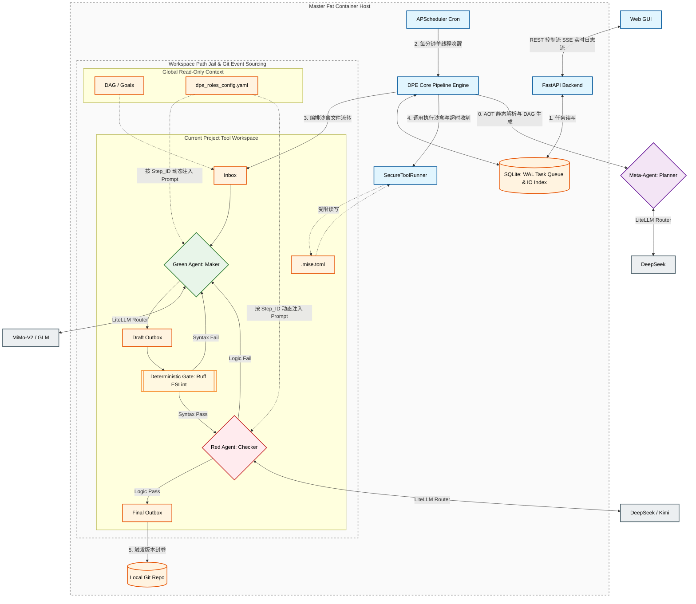

# AItelier: 确定性 AI 流水线 (DPE) 核心系统设计白皮书 V3.0

> **核心哲学：工具的归工具，脑子的归脑子。**
> 彻底抛弃大模型作为“操作系统调度者”的幻觉，将其降维为受限于物理沙盒与确定性拦截网的“无状态函数”。

---

## 1. 项目边界 (Goals & Non-Goals)

**Goals (核心必须做到的绝对红线):**

* **黑盒化极简 UX:** 用户不再是“工作流编辑器”的操纵者。用户仅输入初步需求，系统接管所有架构生成、代码编写、本地试错与沙盒测试。前端仅通过 SSE 展示进度条与单向日志流。
* **AOT 静态规划 (Ahead of Time):** 彻底杜绝在运行期间（Runtime）动态挂起任务或猜测依赖。Meta-Agent 必须在第 2 步（系统设计阶段）全局扫描本地工具库，静态生成完整的“有向无环图 (DAG)”。
* **Inbox/Outbox 绝对物理隔离:** 切断 LangGraph 等框架的隐式上下文共享。第 N 步的流转只能读取 `Inbox_N` 的静态文件，处理后写入 `Outbox_N`。大模型上下文杜绝向后传染。全局配置（Goals/Arch）以只读形态挂载。
* **异构 Red/Green 对弈:** Green Team (Maker, 采用 GLM/MiMo-V2) 与 Red Team (Checker, 采用 DeepSeek/Kimi) 隔离运作。拒绝同源模型自嗨，强制设定重试熔断阈值。
* **确定性拦截网 (Shift-Left Validation):** 强制在代码移交 LLM (Red Team) 审查前，插入本地 AST 解析与 Linter (Ruff/ESLint)。语法不通过直接原地打回 Green Team，**绝对不消耗逻辑模型的 Token**。
* **单线贪婪调度:** 针对本地算力优化，取消并发调度。由 APScheduler 每分钟轮询 SQLite 队列，提取并独占执行单条流转链路，规避 API 限流与本地环境死锁。
* **降维单体沙盒与跨语言垫片:** 采用单个宿主 Fat Container（或直接基于宿主机）。依靠 `mise` 运行时管理器与目录级 `.mise.toml` 实现毫秒级的 Python/Node/Java 环境切换，结合 `Pathlib` 软锁阻止 `../` 越权遍历。
* **时光机溯源 (Event Sourcing):** 每一步 Final Outbox 产出皆触发底层的 `git commit`。配合 SQLite 索引，支持跨越死锁的原子级 `git reset --hard` 状态回滚。
* **工具飞轮 (CapEx -> OpEx):** 万物皆项目。AI 生成的自定义工具经历完整的五步法闭环测试后，注册至本地环境 `~/.local/share/aitelier_tools/`，供后续项目的 DAG 静态复用，实现算力消耗的边际递减。

**Non-Goals (当前版本绝对不碰的边界):**

1. **复杂的节点连线式 (Node-based) UI:** 拒绝引入类似 Dify/Coze 的可视化拖拽画布，增加无谓的认知负担。
2. **动态容器编排:** 绝对不引入 Docker-in-Docker (DinD) 或 Kubernetes 集群做子任务隔离，这会带来无法接受的 I/O 延迟和运维成本。
3. **隐式状态黑盒:** 绝对不使用任何封装了不可见 Memory 系统的第三方 Agent 框架（如 AutoGen、ChatDev、LangChain）。

---

## 2. 系统架构图 (Architecture Map)

使用 Mermaid 描述 DPE 引擎的拓扑结构与数据流转路径：

## 3. 核心设计 (Core Design)

### Data Models (数据结构)

基于 Pydantic V2 构建强类型验证：

TaskQueue (SQLite): id (PK), project_id, prompt, status (pending/running/completed/failed), created_at。

IO_Log (SQLite): task_id, step_name, direction (INBOX/OUTBOX), git_commit_hash (事件溯源锚点), content_summary。

Message_Unit (File System): 强制 JSON 结构封装任务负载 {"step_id": "", "attempt_count": 0, "payload": {}}。

### Data Flow (流转规则)

提交与唤醒: Web 发送请求 -> SQLite TaskQueue (PENDING) -> APScheduler 轮询使用 UPDATE...RETURNING 原子锁将任务提拔为 RUNNING。

拓扑执行 (Pipeline Mapping): 根据 DAG 序列，提取 Outbox_Final(N) 的数据作为 Inbox(N+1) 的绝对输入。

异构对抗循环 (Actor-Critic Loop):

Green 生成草案 -> 写入 Outbox_Draft。

执行静态拦截 -> 若失败，抓取 stderr 回传 Green 重试。

执行逻辑验证 -> Red Team 审查，若失败，提取 feedback 回传 Green 重试。

连续失败达 Max_Retries -> 硬熔断，抛出异常并触发隔离。

实时转播: SecureToolRunner (通过 subprocess) 产生的 stdout/stderr 被推入 asyncio.Queue，通过 FastAPI 的 SSE 管道实时广播至客户端。

归档溯源: 审查通过 -> git add . && git commit -> 获取 SHA-1 写入 SQLite 索引 -> 触发 DAG 下一节点。

### Tech Stack (技术底座)

核心引擎: Python 3.12, FastAPI, Pydantic V2, APScheduler。

持久层: SQLite 3 (强制配置 PRAGMA journal_mode=WAL; 保障高并发), 原生 subprocess 调用 Git。

沙盒层: mise (毫秒级跨语言运行时垫片), Python sh 库, os.killpg 配合 SIGKILL 收割死循环进程树。

AI 路由: litellm (统一挂载多模型，集成 tenacity 退避重试防限流，并精准审计 Token 开销)。

## 4. 技术选型 (Tech Selection)

选定方案: 完全自研底层状态机 + 纯文件系统挂载的 DPE (Deterministic Pipeline Engine)。这是唯一能从物理层面保障上下文不溢出、隔离越权攻击的方案。

备用/淘汰方案: LangGraph 或 AutoGen。被否决原因：它们将系统的状态机维护在内存变量或黑盒对象中，缺乏直接的文件系统级控制力，无法实现廉价的 Git 事件溯源，且容易陷入死锁或幻觉污染。

官方参考依赖:

* FastAPI SSE (StreamingResponse)

* SQLite WAL Mode

* LiteLLM Routing & Fallbacks

* Mise-en-place (Runtime Manager)

## 5. 实施步骤 (Macro / Micro Steps)

本实施路线图采用 自底向上 (Bottom-Up) 的 TDD 驱动，所有前置基础设施（阶段一）必须 100% 绿色通过，方可进入引擎组装（阶段二）。

### 阶段一：CapEx 基础设施 (✓ 已验收完成)

* Macro Step 1: DPE 核心状态机与持久化基座

* Micro Step 1.1: 配置 Pydantic 领域模型 (TaskCreate, IOLogCreate, TaskStatus 枚举)。

* Micro Step 1.2: 配置 SQLite (WAL) 连接池，建立 Task Queue 与 IO_Log 的原子性 CRUD 调度逻辑。

* Macro Step 2: 工作区沙盒与安全防御

* Micro Step 2.1: 建立 Workspace 初始化逻辑，实现物理目录 (inbox, outbox_draft 等) 生成。

* Micro Step 2.2: 封装原生 Git 子进程，实现 commit 与 reset --hard 的时光机 API。

* Micro Step 2.3: 编写 security_jail.py，利用 Pathlib.resolve() 硬编码路径越权锁，拦截 Path Traversal 攻击。

* Micro Step 2.4: 编写 SecureToolRunner，利用 preexec_fn=os.setsid 和 os.killpg 设定硬超时与僵尸进程树收割。

* Macro Step 3: API 控制面与日志管道

* Micro Step 3.1: 搭建 FastAPI RESTful 接口进行任务派发与状态检索。

* Micro Step 3.2: 建立 asyncio.Queue 管道，将底层执行日志通过 Server-Sent Events (SSE) 暴露给前端黑盒。

### 阶段二：核心业务逻辑 (✓ 已验收完成)

* Macro Step 4: LLM 路由与 Agent 对弈逻辑 ✓
    * Micro Step 4.1: 接入 litellm，编写 `core/ai_router.py`。支持本地 provider 注册表 (`llm_providers.json`)，自动翻译为 OpenAI 兼容协议。
    * Micro Step 4.2: 组装带有 Global Context 和 Inbox 的 Green (Maker) 与 Red (Checker) Agent System Prompt。`AgentFactory` 解析 `dpe_roles_config.yaml` 注入 JSON action schemas。

* Macro Step 5: 确定性拦截网 (Shift-Left Validation Gate) ✓
    * Micro Step 5.1: `core/deterministic_gate.py` — AST 解析与 Linter 强制拦截，语法失败直接打回 Green 不消耗 Red Token。
    * Micro Step 5.2: DPE 流水线中强制执行 deterministic check，Red Agent 专注于逻辑审查。

* Macro Step 6: DPE 核心流转中枢 (The Pipeline Heart) ✓
    * Micro Step 6.1: `core/dpe_pipeline.py` (`PipelineEngine`) — 串联 Green → Deterministic Gate → Red → Final Outbox → Git 归档。
    * Micro Step 6.2: `core/scheduler.py` — APScheduler 单线贪婪调度，支持 project-priority-first 和 FIFO (demo) 两种策略。
    * 步骤序列: Project-level (`1→1_5→2→3`) + Task-level (`t_sota→t_design→t_impl→t_verify`) + Final verification (`5`)。

* Macro Step 7: 静态规划与工具飞轮 (Meta-Agent & Asset Registry) ✓
    * Micro Step 7.1: `core/meta_conversation.py` + `core/meta_orchestrator.py` — Meta-Agent 通过交互式对话生成项目 brief 和 DAG。支持 intent detection、requirement assessment、brief generation。
    * Micro Step 7.2: `core/asset_registry.py` — 本地工具注册表。

### 阶段三：产品化与交互优化 (⏳ 当前阶段)

* Macro Step 8: CLI 交互与 UX
    * Typer + Rich 交互式 dashboard，SSE 实时日志流。
    * Meta-conversation flow: 用户输入需求 → 意图检测 → 需求确认对话 → Brief 生成 → Checkpoint 审批 → Pipeline 自动启动。
    * Step-by-step 模式: 每步暂停等待用户审批，支持 rollback。
    * `core/interaction_meta.py` — 管理 pipeline 执行中的用户交互断点。

* Macro Step 9: Web GUI 后端
    * `web_api/` — 多租户 FastAPI 后端 (Cloudflare Access)。
    * `web_api/scheduler_manager.py` — `UserSchedulerManager` 支持按用户分配独立调度器。
    * 两种模式: `demo` (共享调度器) 和 `normal` (per-user schedulers)。

* Macro Step 10: 开发调试工具
    * `debugctl.py` — tmux-based CLI debug controller。将交互式 CLI 包装在 tmux session 中，支持屏幕捕获、键盘输入、workspace 文件监控。
    * 用于 Claude Code 等外部工具对 AItelier CLI 进行 UX 调试和 pipeline 行为观察。
